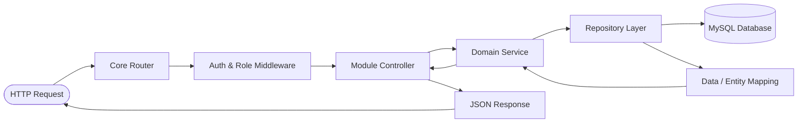

# Medi-Care Online Appointment System

> A modern, secure healthcare appointment and clinic management platform connecting **Patients**, **Doctors**, and **Administrators** in one unified ecosystem.


---

## 1. Project Status

The **Medi-Care Online Appointment System** is fully implemented, verified, and operational:

- **Backend**: Built with modern PHP using a clean Layered MVC architecture, custom HTTP routing, JSON REST responses, robust JWT authentication, role guards, and transactional database repositories.
- **Frontend**: Single Page Application (SPA) powered by React 19, TypeScript, Vite, Tailwind CSS, TanStack React Query, and Lucide React icons.
- **Database**: Normalized MySQL relational schema with foreign key integrity, indexing, automated schema migration, and a comprehensive database seeder.

The application is turnkey and ready to run locally for development, evaluation, and demonstration.

---

## 2. Features by Role

### 👤 Patient / User Portal
- **Authentication & Security**: Account registration, secure login with JWT sessions, token expiration handling, and clean logout.
- **Browse Specialties & Doctors**: Real-time search by doctor name, specialization, or medical department with detailed qualification and consultation fee display.
- **Doctor Profiles & Schedules**: View doctor credentials, biography, room number, fees, and weekly consultation availability.
- **Slot Discovery & Booking**: Interactive booking modal fetching available slots for any chosen date while dynamically locking out conflicting appointments.
- **Appointment Management**: View upcoming visits, appointment history, status indicators (`PENDING`, `APPROVED`, `COMPLETED`, `CANCELLED`), and self-service appointment cancellation.
- **Clinical History**: Access doctor consultation notes, diagnoses, and medical prescriptions recorded during completed appointments.

### 🩺 Doctor Clinical Portal
- **Registration & Verification Flow**: Self-registration for doctors requiring professional profile details plus **two mandatory verification fields**:
  - **Medical License Number**: Unique, 5–30 characters, alphanumeric with hyphens and slashes only (`/^[A-Za-z0-9\-\/]{5,30}$/`).
  - **Profile Photo**: JPG, PNG, or WebP (max 2 MB), validated server-side with `finfo`.
  - Account is initially registered in `pending` status.
- **Verification Workflow**:
  ```
  Doctor Registers (with License Number + Profile Photo)
        ↓
  Status: 'pending' (Access to clinical portal withheld)
        ↓
  Admin Reviews at /admin/doctor-requests (Verifies photo & license number against official medical council register)
        ├── Admin Approves → Status: 'active' → Doctor can log in and manage clinic
        └── Admin Rejects  → Status: 'rejected' → Application denied with feedback
  ```
- **Clinical Dashboard**: Real-time overview of today's schedule, pending appointments, active patient count, and upcoming consultations.
- **Schedule Management**: Weekly schedule builder to configure working days, shift hours (`start_time` - `end_time`), slot duration (default 30 mins), and toggle daily availability.
- **Appointment Processing**: Review patient requests, approve appointments, mark visits as completed, or reject/cancel conflicts.
- **Consultation Records & EMR Notes**: Record patient diagnosis, prescriptions, and clinical visit notes linked directly to the appointment.
- **Doctor Profile Settings**: Update biography, contact phone, consultation fees, department assignment, room/office location, and upload a new profile photo (re-generates thumbnail and purges old image files). License number is displayed as read-only.

### 🛡️ Administrator Control Center
- **Protected Administrative Access**: Admin accounts are pre-seeded via configuration and cannot be registered publicly via client endpoints.
- **Real-Time Analytics & Stats**: High-level KPIs tracking total active doctors, pending doctor approval requests, registered patients, today's appointments, upcoming bookings, and active departments.
- **Doctor Credentialing & Approval Queue**: Dedicated review inbox to examine doctor registration requests, review qualifications and departments, with single-click Approve (`active`) or Reject (`rejected`) actions.
- **Doctor Directory Management**: Filter and manage doctors across all statuses (`active`, `pending`, `rejected`, `inactive`) with account status toggles.
- **Patient Management**: Central directory of all registered patients, contact details, account status, and appointment visit history counts.
- **Department Administration**: Full CRUD capabilities to create, edit, activate, or deactivate clinical departments and icons.
- **Central Appointment Oversight**: Comprehensive monitoring of all hospital appointments with multi-criteria filtering by date and status.
- **Hospital Reports & Breakdown**: Visual breakdowns of appointments categorized by status and doctors distributed across departments.

---

## 3. Tech Stack

| Layer | Technologies & Libraries | Purpose |
| :--- | :--- | :--- |
| **Frontend Framework** | React 19, TypeScript (~5.7), Vite 6 | High-performance SPA with strict type safety and fast HMR |
| **Styling & UI** | Tailwind CSS 3.4, PostCSS, Lucide React, clsx, tailwind-merge | Modern clinical UI, responsive layouts, accessible components |
| **Routing & Navigation** | React Router DOM v7 | Nested routing, layout wrappers, and protected role-based guards |
| **State & API Client** | TanStack React Query v5, Axios | Server-state caching, automatic refetching, JWT interceptors |
| **Backend Framework** | PHP 8.1+ / 8.2+ (Custom MVC) | Modular routing, middleware pipeline, service/repository layers |
| **Persistence / ORM** | MySQL 8.x / MariaDB, PHP PDO | Normalized relational schema, prepared statements, transactions |
| **Authentication** | Custom HMAC-SHA256 JWT, Bcrypt | Stateless Bearer token auth, role authorization, secure password hashing |
| **Local Environment** | XAMPP (Apache + MySQL), Composer, Node.js | Cross-platform local server hosting and package dependency management |

---

## 4. Architecture & Design Patterns

### Backend: Layered Clean MVC Architecture
The backend follows a clear separation of concerns to guarantee testability and maintainability:



- **Router (`App\Core\Router`)**: Resolves incoming HTTP method and URI paths, handles CORS pre-flight headers, extracts path parameters (e.g. `{id}`), and executes route-specific middleware chains.
- **Middleware Pipeline (`App\Middleware`)**:
  - `CorsMiddleware`: Manages cross-origin resource sharing, allowable headers, and 204 OPTIONS preflights.
  - `AuthMiddleware`: Validates Bearer JWT tokens, verifies user active status in the database, and attaches the authenticated user context to the request.
  - `RoleMiddleware`: Enforces fine-grained Role-Based Access Control (`patient`, `doctor`, `admin`) and verifies doctor activation status.
- **Controllers (`App\Modules\*` )**: Thin HTTP handlers that extract request bodies, query parameters, invoke appropriate service methods, and output standardized JSON responses (`App\Core\Response`).
- **Services (`App\Modules\*` )**: Encapsulate core business rules (e.g. preventing duplicate appointment times, calculating available 30-minute intervals, validating registration data, and orchestrating status transitions).
- **Repositories (`App\Modules\*` )**: Dedicated data-access objects abstracting SQL queries, utilizing PDO prepared statements to safeguard against SQL injection.
- **Database (`App\Config\Database`)**: Singleton PDO connection manager with automated `.env` environment variable loading and database initialization.

### Frontend: Feature-Based Modular Architecture
The frontend codebase is partitioned into self-contained feature slices:

```
frontend/src/
├── app/               # Application-level bootstrapping
│   ├── providers/     # QueryClientProvider, AuthProvider context
│   └── router/        # AppRouter, ProtectedRoute, RoleRoute definitions
├── components/        # Reusable global design system
│   ├── layout/        # Navbar, Sidebar, AdminLayout, DoctorLayout, DashboardLayout
│   └── ui/            # Button, Input, Modal, Card, Table, Badge, Toast, States
├── features/          # Domain-driven feature modules
│   ├── admin/         # Admin API services, queries, and mutations
│   ├── appointments/  # Booking modals, appointment listings, slot hooks
│   ├── auth/          # Auth context, login/register API calls, token persistence
│   ├── departments/   # Department listings, queries, and types
│   └── doctors/       # Doctor directory hooks, schedule management
├── lib/               # Shared utilities (Axios instance, queryKeys factory, QueryClient)
└── pages/             # Route-level view components (Public, Patient, Doctor, Admin)
```

### Data Freshness & Caching Architecture
- **Single Source of Truth (`['auth', 'me']`)**:
  - The authenticated user identity is driven exclusively by the React Query cache key `['auth', 'me']` (`GET /api/auth/me`).
  - Stale duplicates in separate `useState` or `localStorage` copies are eliminated (only the JWT Bearer token is persisted in client storage).
  - Profile updates (e.g., name, avatar, contact) immediately call `queryClient.setQueryData(queryKeys.auth.me, updatedUser)` using the server response, synchronizing the header, sidebar, and dashboard in real time without requiring page refreshes.
- **Central Query Key Factory (`FE/src/lib/queryKeys.ts`)**:
  - All query keys are managed systematically through a central factory (`queryKeys.auth.me`, `queryKeys.doctors.*`, `queryKeys.appointments.*`, `queryKeys.departments.*`, `queryKeys.admin.*`).
  - Every mutation precisely invalidates affected cache entries upon settlement (e.g. appointment updates invalidate slots and dashboard statistics, department mutations invalidate doctor and department listings).
- **Default Policy & Optimistic Updates**:
  - Default `staleTime` is set to 30 seconds with `refetchOnWindowFocus: true` and single retry (skipping 401, 403, and 404 errors).
  - High-tempo surfaces (appointment queues and administrative operational counters) leverage a 30-second `refetchInterval` for automated polling.
  - Optimistic updates with rollback are applied exclusively to fast toggles (such as activating or deactivating medical staff accounts).
  - Image URLs incorporate a cache-busting version query string (`?v={timestamp}`) to eliminate browser asset staleness.

---

## 5. Authentication & Security

1. **Stateless JWT Authentication**:
   - Access tokens are cryptographically signed using HMAC-SHA256 with the server's `JWT_SECRET`.
   - Token payload encapsulates `sub` (User ID), `email`, and `role`.
   - Configurable expiration (default 24 hours / 86400 seconds via `JWT_EXPIRY`).
2. **Password Protection**:
   - Secure one-way password hashing using `PASSWORD_BCRYPT` with dynamic salt generation.
   - Verified via native `password_verify` on authentication.
3. **Role-Based Access Control (RBAC)**:
   - Routes and resources strictly segregated into `patient`, `doctor`, and `admin` scopes.
   - Frontend route guards (`ProtectedRoute`, `RoleRoute`) prevent unauthorized client-side views.
   - Backend controller middleware guarantees zero unauthorized data leaks at the API layer.
4. **Doctor Credentialing & Approval Gate**:
   ```
   Doctor Registers (License + Photo) -> Status: 'pending' -> Admin checks license number & photo -> Approve/Reject
         ├── Admin Approves -> Status: 'active'   -> Doctor logs in & manages clinic
         └── Admin Rejects  -> Status: 'rejected' -> Login blocked with status notification
   ```
5. **Admin Safeguards**:
   - Administrative registration is completely disabled over the public registration endpoint.
   - Admin credentials are provisioned securely through environment variables and seed scripts.

---

## 6. Project Structure

```
Medi-Care Online Appointment System/
├── backend/
│   ├── config/                     # Configuration definitions
│   ├── migrations/
│   │   ├── schema.sql              # Relational database schema
│   │   └── seed.php                # Database migration runner & data seeder
│   ├── public/
│   │   └── index.php               # Single entry point / API dispatcher
│   ├── src/
│   │   ├── Config/
│   │   │   └── Database.php        # PDO connection & .env parser
│   │   ├── Core/
│   │   │   ├── Jwt.php             # JWT encode/decode implementation
│   │   │   ├── Request.php         # HTTP Request abstraction
│   │   │   ├── Response.php        # Standardized JSON response emitter
│   │   │   └── Router.php          # RESTful route matcher & dispatcher
│   │   ├── Middleware/
│   │   │   ├── AuthMiddleware.php  # Token validation & user session loader
│   │   │   ├── CorsMiddleware.php  # CORS header configuration
│   │   │   └── RoleMiddleware.php  # Role-based authorization guard
│   │   ├── Modules/
│   │   │   ├── Admin/              # Admin stats, doctor approvals, reports
│   │   │   ├── Appointment/        # Booking, cancellation, status, consultation
│   │   │   ├── Auth/               # Login, registration, profile retrieval
│   │   │   ├── Department/         # Department management
│   │   │   └── Doctor/             # Doctor profiles, schedules, search
│   │   └── Routes/
│   │       ├── api.php             # API route definitions
│   │       └── ApiRoutes.php       # Static route registry
│   ├── vendor/
│   │   └── autoload.php            # PSR-4 Autoloader
│   ├── .env.example                # Backend configuration template
│   └── .gitignore
│
├── frontend/
│   ├── public/                     # Static assets & favicon
│   ├── src/
│   │   ├── app/                    # Routing, AuthProvider, React Query
│   │   ├── components/             # Reusable UI & Layout components
│   │   ├── features/               # Feature-based business logic & hooks
│   │   ├── lib/                    # Axios client & helper utilities
│   │   ├── pages/                  # Page views (Patient, Doctor, Admin, Auth)
│   │   ├── styles/                 # Tailwind CSS styles
│   │   ├── main.tsx                # Application mounting entry point
│   │   └── vite-env.d.ts
│   ├── index.html
│   ├── package.json                # Frontend dependencies and scripts
│   ├── postcss.config.js
│   ├── tailwind.config.js          # Tailwind CSS theme configuration
│   ├── tsconfig.json               # TypeScript configuration
│   └── vite.config.ts              # Vite server & API proxy config
│
└── README.md
```

---

## 7. Prerequisites

Before running the application, make sure the following software is installed on your workstation:

- **XAMPP** (or standalone Apache & MySQL / MariaDB)
- **PHP**: Version `8.1` or higher (PHP 8.2 recommended, with `pdo_mysql`, `mbstring`, `json`, and `openssl` extensions enabled)
- **Composer**: Dependency manager for PHP (or use the built-in PSR-4 autoloader)
- **Node.js**: Version `18.x` or `20.x` LTS
- **npm**: Version `9.x` or higher

---

## 8. Installation & Setup

### Step 1: Clone the Repository
```bash
git clone https://github.com/shaamyll/Medicare-online-appointment-system.git
cd "Medicare-online-appointment-system"
```

---

### Step 2: Configure and Run the Backend (BE/)

1. **Navigate to the backend directory (`BE/`)**:
   ```bash
   cd backend
   ```

2. **Set up Environment Variables**:
   Copy the example environment file to `BE/.env`:
   ```bash
   # On Windows (PowerShell)
   Copy-Item .env.example .env

   # On Linux/macOS
   cp .env.example .env
   ```

3. **Configure Database & Secrets**:
   Open `BE/.env` and update your MySQL connection details and a secure JWT key (see [Environment Variables](#9-environment-variables)).

4. **Start MySQL in XAMPP**:
   Open the **XAMPP Control Panel** and start the **MySQL** module (default port `3306`).

5. **Run Migrations & Database Seeder**:
   Execute the migration script in `BE/` to automatically create the database `medicare_appointment_db`, generate the SQL schema tables, and insert initial seed data (departments, doctors, patients, and the admin account):
   ```bash
   php migrations/seed.php
   ```
   *Expected output:*
   ```text
   Running migrations...
   Schema migrated successfully.
   Seeded Admin: admin@medicare.com / ********
   Seeded departments.
   Seeded Approved Doctor: dr.sarah@medicare.com / ********
   Seeded Pending Doctor Request: dr.michael@medicare.com
   Seeded Demo Patient: patient@medicare.com / ********
   Database seeding finished successfully!
   ```

6. **Start the Backend Server**:
   You can serve the backend via PHP's built-in development server pointing to `BE/public/`:
   ```bash
   php -S localhost:8000 -t public
   ```
   Alternatively, place the project inside your XAMPP `htdocs` directory and serve via Apache.

---

### Step 3: Configure and Run the Frontend (FE/)

1. **Navigate to the frontend directory (`FE/`)**:
   ```bash
   cd ../frontend
   ```

2. **Install Dependencies**:
   ```bash
   npm install
   ```

3. **Configure API Base URL (Optional)**:
   By default, Vite is configured with a proxy in `FE/vite.config.ts` redirecting all `/api` requests to `http://localhost:8000`. If you wish to specify an explicit endpoint, create an environment file in `FE/.env`:
   ```bash
   VITE_API_URL=http://localhost:8000/api
   ```

4. **Start the Frontend Development Server**:
   ```bash
   npm run dev
   ```

5. **Access the Web Application**:
   Open your browser and navigate to:
   ```
   http://localhost:5173
   ```

---

## 9. Environment Variables

The backend uses a configuration file in `BE/.env` loaded automatically by `App\Config\Database::loadEnv()`.

| Variable | Description | Example / Default |
| :--- | :--- | :--- |
| `DB_HOST` | Host address of the MySQL database server | `127.0.0.1` |
| `DB_PORT` | Port number for the MySQL database connection | `3306` |
| `DB_NAME` | Name of the application database | `medicare_appointment_db` |
| `DB_USER` | MySQL database username | `root` |
| `DB_PASS` | MySQL database password (placeholder) | `<your-db-password>` |
| `JWT_SECRET` | Secret key used to sign and verify HMAC-SHA256 JWTs | `<your-jwt-secret>` |
| `JWT_EXPIRY` | Token time-to-live in seconds (e.g. 86400 = 24 hours) | `86400` |
| `ADMIN_NAME` | Initial administrator full name used by the seeder | `Hospital Administrator` |
| `ADMIN_EMAIL` | Initial administrator login email used by the seeder | `admin@medicare.com` |
| `ADMIN_PASSWORD`| Initial administrator password used by the seeder | `<your-admin-seed-password>` |

> [!NOTE]
> Never commit active secrets or database passwords to version control. Keep `BE/.env` and `FE/.env` included in your `.gitignore`.

---

## 10. Default Admin & Demo Access

For security, the administrator role cannot be registered through public forms. It is initialized strictly through `BE/migrations/seed.php` using the values configured in `BE/.env`.

### 🔐 Administrative Access
- **Standard Login Screen**: The hospital administrator signs in through the standard user login screen (`/login`) using the seeded credentials. The login interface contains no text, link, hint, or visual indicator suggesting administrative access.
- **Dashboard Redirect**: Upon successful authentication, administrators are automatically redirected by the system to `/admin/dashboard`.
- **Credentials**: Configured via `ADMIN_EMAIL` and `ADMIN_PASSWORD` in your `BE/.env` file.
- **Modifying Admin Credentials**: You can modify `ADMIN_EMAIL` and `ADMIN_PASSWORD` in `BE/.env` prior to executing `php migrations/seed.php`. To change credentials later, update the `users` table record or change the password hash in the database.

### 🧪 Pre-Seeded Demo Accounts for Testing
The seeder creates working demo accounts for each role so you can test all workflows immediately:

| Role | Email | Password (from seeder) | Sign-In Portal & Purpose |
| :--- | :--- | :--- | :--- |
| **Admin** | `admin@medicare.com` | *From `BE/.env`* | Signs in via `/login` &rarr; redirected to `/admin/dashboard` |
| **Approved Doctor** | `dr.sarah@medicare.com` | `Doctor123!` | Signs in via `/doctor/login` &rarr; access clinical schedules & appointments |
| **Pending Doctor** | `dr.michael@medicare.com` | `Doctor123!` | Signs in via `/doctor/login` &rarr; test pending approval verification block |
| **Patient** | `patient@medicare.com` | `Patient123!` | Signs in via `/login` &rarr; browse doctors, book slots, cancel visits |

---

## 11. User Flows & Application Routes

### Client-Side Routes (Frontend - FE/)

The application features exactly **two public authentication screens** (Patient/User portal and Doctor portal) with role-guarded redirection:

| Path | Access Level | Layout / Component | Description |
| :--- | :--- | :--- | :--- |
| `/` | Public | `LandingPage` | Home hero, clinical specialties, department overview, call-to-actions |
| `/login` | Public | `LoginPage` | User login & patient registration toggle (also used by seeded admin) |
| `/doctor/login` | Public | `DoctorLoginPage` | Doctor clinical login & medical specialist application toggle |
| `/dashboard` | Patient | `DashboardLayout` | Patient overview, upcoming appointments, quick doctor search |
| `/dashboard/appointments` | Patient | `PatientAppointmentsPage` | View appointment status, book new slot, cancel visits, read notes |
| `/dashboard/doctors` | Patient | `DoctorsBrowsePage` | Directory of approved doctors with search & department filters |
| `/doctor/dashboard` | Doctor | `DoctorLayout` | Clinical summary, today's schedule, patient count |
| `/doctor/appointments`| Doctor | `DoctorAppointmentsPage` | Manage bookings, approve/reject, add diagnosis & prescriptions |
| `/doctor/schedule` | Doctor | `DoctorSchedulePage` | Configure working days, start/end hours, and appointment durations |
| `/doctor/patients` | Doctor | `DoctorPatientsPage` | View assigned patients and their past consultations |
| `/doctor/profile` | Doctor | `DoctorProfilePage` | Update specialization, consultation fees, biography, and room number |
| `/admin/dashboard` | Admin | `AdminLayout` | Overview metrics, quick actions, recent hospital appointments |
| `/admin/doctors` | Admin | `AdminDoctorsPage` | Doctor roster management and account status toggles |
| `/admin/doctor-requests`| Admin | `AdminDoctorRequestsPage` | Review and approve/reject pending doctor applications |
| `/admin/patients` | Admin | `AdminPatientsPage` | Directory of registered hospital patients |
| `/admin/departments`| Admin | `AdminDepartmentsPage` | Create, update, and manage medical departments |
| `/admin/appointments`| Admin | `AdminAppointmentsPage` | Global oversight and filters for all hospital bookings |
| `/admin/settings` | Admin | `AdminSettingsPage` | Administrative environment and configuration overview |

---

## 12. API Reference Overview

All API endpoints are hosted by `BE/` and prefixed with `/api` (or accessed directly depending on router dispatch).

### 🔑 Authentication & Profile
| Method | Endpoint | Role Required | Description |
| :--- | :--- | :--- | :--- |
| `POST` | `/api/auth/login` | Public | Patient & Admin login; returns JWT token & user object |
| `POST` | `/api/auth/doctor/login` | Public | Doctor login with status verification (pending, rejected, active) |
| `POST` | `/api/auth/register` | Public | Register patient account (creates `patient` role only) |
| `POST` | `/api/auth/doctor/register` | Public | Submit doctor application (creates doctor with `pending` status) |
| `GET` | `/api/auth/me` | Authenticated | Retrieve current user profile and doctor metadata |
| `GET` | `/api/health` | Public | Verify backend availability and system timestamp |

### 🏥 Departments & Doctors
| Method | Endpoint | Role Required | Description |
| :--- | :--- | :--- | :--- |
| `GET` | `/api/departments` | Public | List all active departments (`?all=true` for admin) |
| `GET` | `/api/departments/{id}` | Public | Retrieve a single department by ID |
| `POST` | `/api/departments` | Admin | Create a new department |
| `PUT` | `/api/departments/{id}` | Admin | Update department name, description, or icon |
| `DELETE`| `/api/departments/{id}` | Admin | Delete / deactivate a department |
| `GET` | `/api/doctors` | Public | Browse approved doctors (filters: `departmentId`, `search`) |
| `GET` | `/api/doctors/{id}` | Public | Detailed doctor profile including weekly schedule |

### 📅 Appointments & Scheduling
| Method | Endpoint | Role Required | Description |
| :--- | :--- | :--- | :--- |
| `GET` | `/api/appointments/slots` | Public / All | Get generated 30-min slots for a doctor & date (`?doctorId=&date=`) |
| `GET` | `/api/appointments` | Authenticated | Retrieve appointments (scoped to patient, doctor, or all for admin) |
| `POST` | `/api/appointments` | Patient | Book a specific appointment slot |
| `POST` | `/api/appointments/{id}/cancel` | Authenticated | Cancel an appointment (Patient, Doctor, or Admin) |
| `PATCH`| `/api/appointments/{id}/status` | Doctor | Update appointment status (`approved`, `completed`, `cancelled`, `rejected`) |
| `POST` | `/api/appointments/{id}/consultation` | Doctor | Save diagnosis, prescription, and consultation notes |

### 🩺 Doctor Workspace
| Method | Endpoint | Role Required | Description |
| :--- | :--- | :--- | :--- |
| `GET` | `/api/doctor/schedule` | Doctor | Retrieve the authenticated doctor's weekly timetable |
| `PUT` | `/api/doctor/schedule` | Doctor | Save/update weekly schedule availability |
| `GET` | `/api/doctor/profile` | Doctor | Retrieve authenticated doctor's profile |
| `PUT` | `/api/doctor/profile` | Doctor | Update bio, room number, fee, qualification, specialization |

### 🛡️ Administrator Operations
| Method | Endpoint | Role Required | Description |
| :--- | :--- | :--- | :--- |
| `GET` | `/api/admin/stats` | Admin | Aggregate dashboard counters and recent appointments |
| `GET` | `/api/admin/doctors` | Admin | List all doctors (supports filter `?status=`) |
| `GET` | `/api/admin/doctor-requests`| Admin | Retrieve pending doctor registrations awaiting approval |
| `POST` | `/api/admin/doctors/{id}/approve` | Admin | Approve a pending doctor account |
| `POST` | `/api/admin/doctors/{id}/reject` | Admin | Reject a pending doctor account |
| `PATCH`| `/api/admin/doctors/{id}/status` | Admin | Change doctor status (`active`, `inactive`, `rejected`) |
| `GET` | `/api/admin/doctors/{id}/delete-impact` | Admin | Return total & upcoming appointments affected by doctor deletion |
| `DELETE`| `/api/admin/doctors/{id}` | Admin | Hard delete doctor, schedules, consultation notes, appointments, user, and avatar files |
| `GET` | `/api/admin/patients` | Admin | List all registered patients with appointment counts |
| `GET` | `/api/admin/reports` | Admin | Distribution analytics (appointments by status, doctors per dept) |

---

## 13. File Uploads & Static Assets

Doctor profile photos and thumbnails are processed and managed entirely on the backend:

- **Native PHP Uploads**: File uploads are processed directly by native PHP business logic (`App\Services\UploadService`), **NOT** multer (which is Node.js-only).
- **Storage Locations**:
  - Full Images: `backend/public/uploads/doctors/`
  - Cropped Thumbnails (300x300 via GD): `backend/public/uploads/doctors/thumbs/`
  - Default Avatar Placeholder: `backend/public/uploads/defaults/doctor-default.png`
- **Allowed Types & Limits**:
  - Allowed MIME types: `image/jpeg`, `image/png`, `image/webp` (validated strictly using PHP `finfo` against file contents, not just client file extensions).
  - Maximum file size: `2 MB`.
- **Security & Execution Protection**:
  - Safe randomized filenames generated via `bin2hex(random_bytes(16)) . '.' . $extension` (never using original client filenames).
  - PHP script execution is disabled inside `backend/public/uploads/.htaccess` and enforced at the router level.
  - Orphan files are automatically deleted via database transactions and cleanup routines on failure or photo update.
- **PHP Extension Requirements**:
  - `ext-gd`: Required for image cropping and generating 300x300 thumbnails.
  - `ext-fileinfo`: Required for verifying actual MIME types.
  - *Enabling in XAMPP*: In `C:\xampp\php\php.ini`, ensure `extension=gd` and `extension=fileinfo` are uncommented (remove the leading semicolon `;`), then restart Apache.

---

## 14. Database Schema & Columns

The relational database (`medicare_appointment_db`) contains the following tables and columns:

### `users`
| Column | Type | Constraints / Description |
| :--- | :--- | :--- |
| `id` | `INT` | PRIMARY KEY, AUTO_INCREMENT |
| `name` | `VARCHAR(100)` | NOT NULL |
| `email` | `VARCHAR(150)` | NOT NULL, UNIQUE, Indexed |
| `password` | `VARCHAR(255)` | NOT NULL (Bcrypt hashed) |
| `role` | `ENUM('admin', 'doctor', 'patient')` | NOT NULL, Indexed |
| `phone` | `VARCHAR(30)` | NULL |
| `status` | `ENUM('active', 'pending', 'rejected', 'inactive')`| DEFAULT 'active', Indexed |
| `created_at` | `DATETIME` | DEFAULT CURRENT_TIMESTAMP |
| `updated_at` | `DATETIME` | DEFAULT CURRENT_TIMESTAMP ON UPDATE CURRENT_TIMESTAMP |

### `departments`
| Column | Type | Constraints / Description |
| :--- | :--- | :--- |
| `id` | `INT` | PRIMARY KEY, AUTO_INCREMENT |
| `name` | `VARCHAR(100)` | NOT NULL, UNIQUE |
| `description` | `TEXT` | NULL |
| `icon` | `VARCHAR(50)` | DEFAULT 'Activity' |
| `is_active` | `TINYINT(1)` | DEFAULT 1 |
| `created_at` | `DATETIME` | DEFAULT CURRENT_TIMESTAMP |

### `doctor_profiles`
| Column | Type | Constraints / Description |
| :--- | :--- | :--- |
| `id` | `INT` | PRIMARY KEY, AUTO_INCREMENT |
| `user_id` | `INT` | NOT NULL, UNIQUE, FOREIGN KEY (`users.id`) ON DELETE CASCADE |
| `department_id` | `INT` | NULL, FOREIGN KEY (`departments.id`) ON DELETE SET NULL |
| `specialization` | `VARCHAR(150)` | NOT NULL, Indexed |
| `qualification` | `VARCHAR(200)` | NOT NULL |
| `license_number` | `VARCHAR(50)` | NULL, **UNIQUE**, Indexed (5–30 chars, alphanumeric + hyphens/slashes) |
| `image_path` | `VARCHAR(255)` | NULL (Relative path to full image in `uploads/doctors/`) |
| `thumbnail_path` | `VARCHAR(255)` | NULL (Relative path to 300x300 thumbnail in `uploads/doctors/thumbs/`) |
| `experience_years`| `INT` | DEFAULT 0 |
| `consultation_fee`| `DECIMAL(10,2)` | DEFAULT 0.00 |
| `bio` | `TEXT` | NULL |
| `room_number` | `VARCHAR(50)` | NULL |
| `created_at` | `DATETIME` | DEFAULT CURRENT_TIMESTAMP |
| `updated_at` | `DATETIME` | DEFAULT CURRENT_TIMESTAMP ON UPDATE CURRENT_TIMESTAMP |

### `doctor_schedules`
| Column | Type | Constraints / Description |
| :--- | :--- | :--- |
| `id` | `INT` | PRIMARY KEY, AUTO_INCREMENT |
| `doctor_id` | `INT` | NOT NULL, FOREIGN KEY (`users.id`) ON DELETE CASCADE |
| `day_of_week` | `ENUM('Monday'...'Sunday')` | NOT NULL |
| `start_time` | `TIME` | NOT NULL |
| `end_time` | `TIME` | NOT NULL |
| `slot_duration_minutes` | `INT` | DEFAULT 30 |
| `is_available` | `TINYINT(1)` | DEFAULT 1 |
| `created_at` | `DATETIME` | DEFAULT CURRENT_TIMESTAMP |

### `appointments`
| Column | Type | Constraints / Description |
| :--- | :--- | :--- |
| `id` | `INT` | PRIMARY KEY, AUTO_INCREMENT |
| `appointment_number` | `VARCHAR(30)` | UNIQUE, NOT NULL |
| `patient_id` | `INT` | NOT NULL, FOREIGN KEY (`users.id`) ON DELETE CASCADE |
| `doctor_id` | `INT` | NOT NULL, FOREIGN KEY (`users.id`) ON DELETE CASCADE |
| `appointment_date` | `DATE` | NOT NULL, Indexed |
| `start_time` | `TIME` | NOT NULL |
| `end_time` | `TIME` | NOT NULL |
| `status` | `ENUM('pending', 'approved', 'rejected', 'completed', 'cancelled')` | DEFAULT 'pending', Indexed |
| `reason_for_visit` | `TEXT` | NULL |
| `created_at` | `DATETIME` | DEFAULT CURRENT_TIMESTAMP |
| `updated_at` | `DATETIME` | DEFAULT CURRENT_TIMESTAMP ON UPDATE CURRENT_TIMESTAMP |

### `consultation_records`
| Column | Type | Constraints / Description |
| :--- | :--- | :--- |
| `id` | `INT` | PRIMARY KEY, AUTO_INCREMENT |
| `appointment_id` | `INT` | NOT NULL, UNIQUE, FOREIGN KEY (`appointments.id`) ON DELETE CASCADE |
| `diagnosis` | `TEXT` | NULL |
| `prescription` | `TEXT` | NULL |
| `consultation_notes`| `TEXT` | NULL |
| `created_at` | `DATETIME` | DEFAULT CURRENT_TIMESTAMP |
| `updated_at` | `DATETIME` | DEFAULT CURRENT_TIMESTAMP ON UPDATE CURRENT_TIMESTAMP |

---

## 15. Project Scope

To ensure high performance, security, and a focused clinical appointment lifecycle, the following features are **intentionally out of scope**:

- ❌ Pharmacy and physical medication inventory management.
- ❌ Payment gateway integration (Stripe, PayPal) and billing/invoicing automation.
- ❌ Full Hospital EMR / inpatient bed management.
- ❌ Nurse, ward staff, or lab technician workflows.
- ❌ Real-time WebRTC audio/video calling.
- ❌ AI-based automated diagnostic or predictive triage tools.

---

## 15. Troubleshooting

### 1. Apache Stripping the Authorization Header in XAMPP
**Issue**: Requests fail with `401 Unauthorized: Missing authentication token` even though a Bearer token is sent in the header.
**Cause**: Apache in XAMPP by default often suppresses the HTTP `Authorization` header in CGI/FastCGI environments.
**Solution**:
1. Check `backend/src/Middleware/AuthMiddleware.php`: Notice the application already supports fallback inspection of `$_SERVER['REDIRECT_HTTP_AUTHORIZATION']`.
2. Ensure your `public/.htaccess` includes the rewrite rule:
   ```apache
   RewriteEngine On
   RewriteCond %{HTTP:Authorization} ^(.*)
   RewriteRule .* - [e=HTTP_AUTHORIZATION:%1]
   ```

### 2. Database Connection Error (`SQLSTATE[HY000] [2002]`)
**Issue**: Backend reports `Database connection failed`.
**Solution**:
- Ensure MySQL is running in the XAMPP Control Panel.
- Check `backend/.env` and verify `DB_HOST=127.0.0.1` and `DB_PORT=3306`. Using `127.0.0.1` instead of `localhost` avoids Unix/Windows named socket conflicts.
- Ensure the password in `DB_PASS` matches your MySQL root user (default XAMPP root password is empty `""`).

### 3. CORS / Pre-flight Blocked
**Issue**: Browser console displays `Cross-Origin Request Blocked`.
**Solution**:
- When running Vite on `localhost:5173` and PHP on `localhost:8000`, the built-in `CorsMiddleware` automatically responds to pre-flight `OPTIONS` requests with appropriate `Access-Control-Allow-Origin: *` headers.
- Alternatively, rely on Vite's built-in proxy in `vite.config.ts`, which proxies `/api` requests locally without triggering CORS restrictions.

### 4. Doctor Account Cannot Log In
**Issue**: Newly registered doctor receives `403 Forbidden` on login attempt.
**Solution**:
- This is intentional: newly registered doctors are placed into `pending` status upon submission.
- Sign in with your administrator credentials via `/login` (which redirects to `/admin/dashboard`), navigate to **Doctor Requests**, and click **Approve** on the doctor's profile. Once approved, the doctor can immediately sign in at `/doctor/login`.

---

## 16. Author & License

- **Author**: Medi-Care Engineering Team
- **Repository**: [https://github.com/shaamyll/Medicare-online-appointment-system](https://github.com/shaamyll/Medicare-online-appointment-system)
- **License**: Released under the [MIT License](LICENSE).
